# EcoSphere ESG Management Platform

EcoSphere is a public-private enterprise ESG (Environmental, Social, and Governance) compliance registry and performance platform. It transitions organizations from error-prone manual spreadsheets to real-time, automated sustainability intelligence integrated with MongoDB database cores.

---
## Demo Credentials

> Click below to request demo credentials.

**[📧 Request Demo Credentials](mailto:chandrupalanisamyaids@gmail.com?subject=EcoSphere%20Demo%20Credentials)**

##  System Architecture & Data Flow

The following flowchart illustrates the public-private partnership ESG data pipeline, mapping how client events (such as carbon inputs or CSR volunteer logging) flow through our FastAPI routers, operational services, scoring models, and down to the MongoDB database and file storage subsystems:

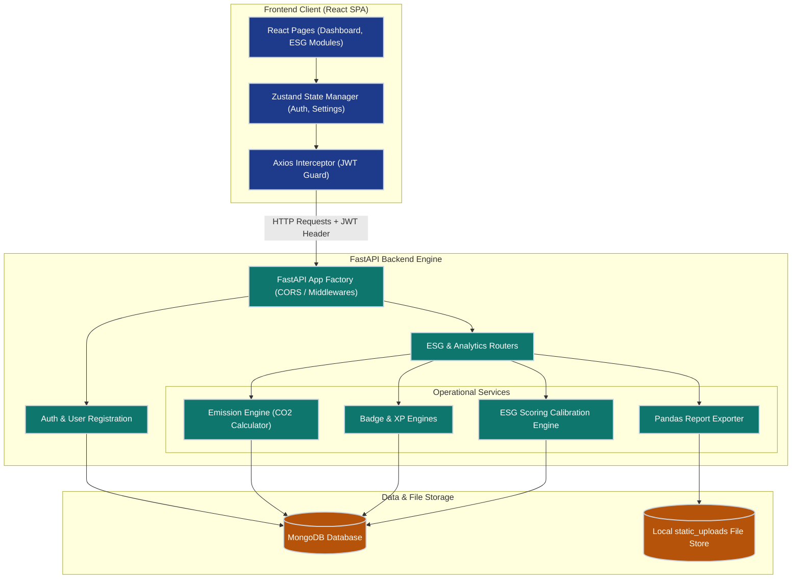

### Data Flow Breakdown
1. **User Request & Interceptors**: React pages pass requests through an Axios interceptor that automatically attaches the user's JWT bearer token.
2. **FastAPI Gateway**: The backend authenticates the token. Requests targeting compliance logs, audits, or reward redemptions are routed to the corresponding controllers.
3. **Calculation & Gamification Engines**:
   * **Environmental**: Quantitative inputs are passed to the `Emission Engine` which multiplies logs by active coefficients to store raw CO₂e weights.
   * **Social**: CSR proof approvals trigger the `Badge Engine` which verifies XP milestones and inserts new badges.
   * **Governance**: Policies, audits, and overdue compliance issues calibrate the weighted ESG total index via the `Scoring Engine`.
4. **Report Compiler**: Custom PDF, Excel, and CSV compilation queries Pandas. The compiled bytes are written to S3 or a local disk static volume, returning an authenticated file stream down to the client.

---

###  Directory Layout

The project is structured as a decoupled monorepo:

```
├── backend/                  # FastAPI Application Core
│   ├── app/
│   │   ├── models/           # Pydantic v2 Schema Definitions
│   │   ├── routers/          # API Controllers
│   │   ├── services/         # Calculation, Gamification, and Scoring Engines
│   │   ├── config.py         # Pydantic BaseSettings Environment Config
│   │   ├── database.py       # Motor (AsyncIO MongoDB) Client
│   │   ├── dependencies.py   # JWT Authentication Guard Injectors
│   │   └── main.py           # FastAPI Core Factory (CORS, Lifespan, Uploads Mount)
│   ├── seed/
│   │   └── seed_data.py      # MongoDB Database Seeding Script
│   └── requirements.txt      # Python Dependencies
│
├── frontend/                 # React SPA (Vite + JavaScript)
│   ├── src/
│   │   ├── components/       # Reusable layout and chart components
│   │   ├── pages/            # Core ESG dashboards and master panels
│   │   ├── services/         # API Service Wrappers (Axios based)
│   │   ├── store/            # Zustand global state (Auth, UI, Settings)
│   │   ├── styles/           # Design System CSS Properties
│   │   ├── App.jsx           # Routing table & guards
│   │   └── main.jsx          # React app mount
│   ├── package.json          # Node Dependencies
│   └── vite.config.js        # Vite + Proxy Configurations
│
└── .env.example              # Environment Variable Templates
```

---

##  Key Platform Features

### 🍀 1. Environmental (E) — Carbon Intelligence
* **Auto-Emission Calculations**: Automatically converts operational quantities (miles driven, kWh consumed) to CO₂e (kg) upon transaction entry using active emission coefficients.
* **Sustainability Goals**: Monitors progress bars (actual vs. targets) with real-time gap analysis highlighting surpluses or deficits.
* **Carbon Tracking**: Aggregates and logs emissions by department and source type (fleet, purchase, utility, refrigerant).

### 🤝 2. Social (S) — Gamification & CSR Ledger
* **CSR Participation**: Logging portal for volunteer hours, complete with evidence upload gates requiring digital proof.
* **Manager Approvals**: Workflow for reviewing evidence, auto-awarding XP and points to employee ledgers.
* **Challenges & Milestones**: Interactive Kanban board displaying enrolled employee challenges.
* **Leaderboards & Rewards**: Employee rankings sorted by XP, and a redemption store to exchange points for catalog items.

### 📋 3. Governance (G) — Compliance & Audit Trails
* **Digital Signatures**: Publish internal policies and track compliance acknowledgements from employees.
* **Overdue Warnings**: Automatically flag unresolved compliance issues in red when due dates pass.
* **Audit Logs**: Maintain signed examiner reports and logs directly tied to internal regulatory standards.

### 📊 4. Analytics & Custom Reports
* **ESG Pillar Breakdown**: Chart visualizers displaying weighted score distributions.
* **Custom Report Builder**: Step-by-step filter wizard to compile targeted CSV, Excel, or PDF documents.
* **Authenticated Streams**: Programmatic blob compilation handling auth headers for secure reports download.

---

##  Local Configuration Setup

### 1. Environment File (`.env`)
Create a `.env` file in the `backend/` and workspace root directories using this template:

```env
# JWT Security
SECRET_KEY=OqX2W9hE5j4sB8VtY7LkNmPqR1sDfGhJkL9zXcVbBnM8aQwErTyUiOpAsDfGhJkL
ALGORITHM=HS256
ACCESS_TOKEN_EXPIRE_MINUTES=1440

# MongoDB Configuration
MONGODB_URL=mongodb://localhost:27017
DB_NAME=odoo

# Local Proof & PDF Upload Directory
# Server mounts backend/static_uploads to /static_uploads statically

# Frontend URL mapping
FRONTEND_URL=http://localhost:5173
```

---

## 🚀 How to Run the Platform

### Step 1: Database Seeding
With your local MongoDB server running on `mongodb://localhost:27017`, seed the database collections:
```bash
# From the backend/ directory
$env:DB_NAME="odoo"; $env:PYTHONIOENCODING="utf-8"; python seed/seed_data.py
```
This script will populate the database with default departments, users, carbon logs, audits, rewards, and default settings.

### Step 2: Start the Backend Server (FastAPI)
```bash
# From the backend/ directory
pip install -r requirements.txt
uvicorn app.main:app --reload
```
* **API Server**: Runs at `http://localhost:8000`
* **Swagger API Documentation**: Accessible at `http://localhost:8000/docs`

### Step 3: Start the Frontend Server (Vite)
```bash
# From the frontend/ directory
npm install
npm run dev
```
* **Vite Dev Server**: Runs at `http://localhost:5173` (Proxies API requests to port `8000`).

---

- # EcoSphere – ESG Management Platform Architecture

> **GitHub Documentation**

## Overview

EcoSphere is an AI-powered ESG (Environmental, Social and Governance) Management Platform that enables organizations to collect operational data, calculate ESG scores, monitor sustainability performance, automate reporting, and generate AI-driven insights.

The platform follows a layered architecture consisting of:

1. User Layer
2. Presentation Layer
3. API Gateway
4. Business Services
5. AI & Analytics
6. ESG Score Engine
7. MongoDB Database
8. External Integrations

---

# 1. User Layer

## Purpose
The User Layer is the entry point of the application.

### Users
- Employees
- Managers
- ESG Officers
- HR
- Auditors
- Admin

### Workflow

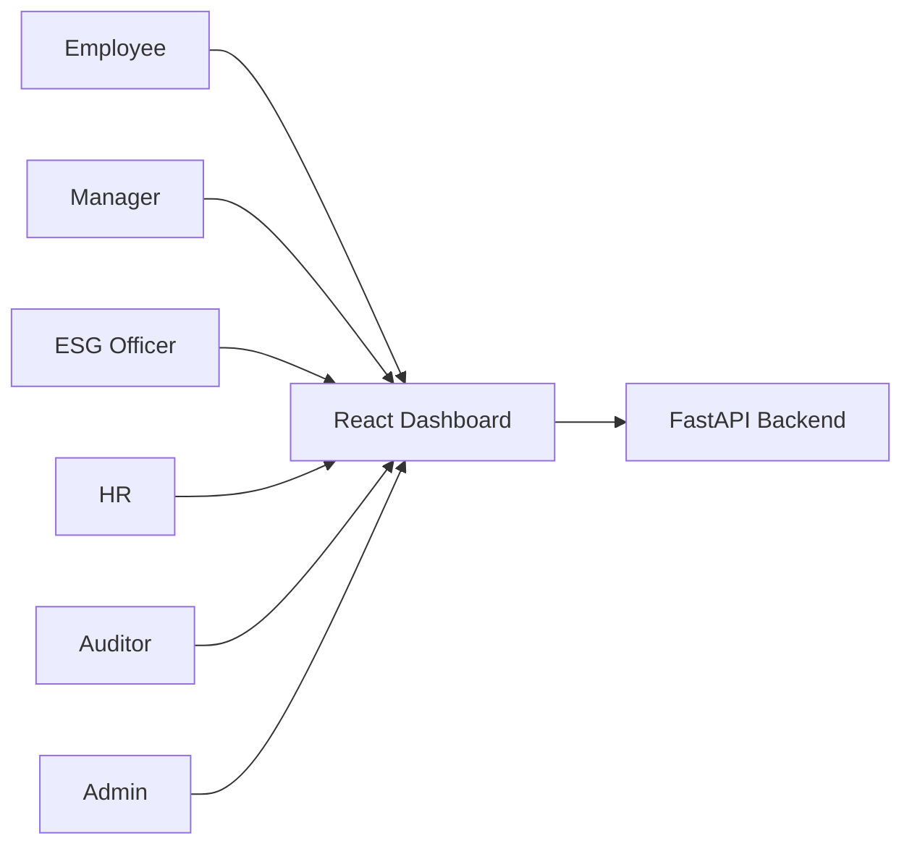

**Explanation**

Users access the React dashboard. Every request is forwarded to the FastAPI backend for authentication and processing.

---

# 2. Presentation Layer

**Technology**

- React
- TypeScript
- Tailwind CSS

### Workflow

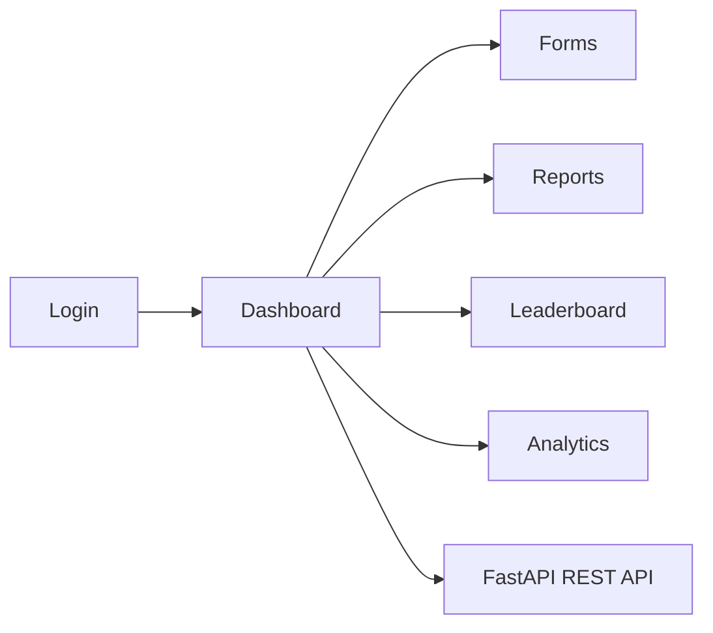

The frontend provides dashboards, forms, analytics, reports, notifications and communicates with the backend through REST APIs.

---

# 3. API Gateway

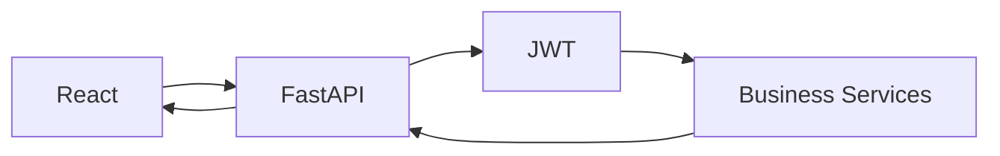

### Responsibilities

- Authentication
- Authorization
- Validation
- Routing
- Business Logic
- Response Generation

---

# 4. Business Services

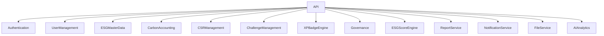

Each service is independent and responsible for one business capability.

---

# 5. Carbon Accounting Flow

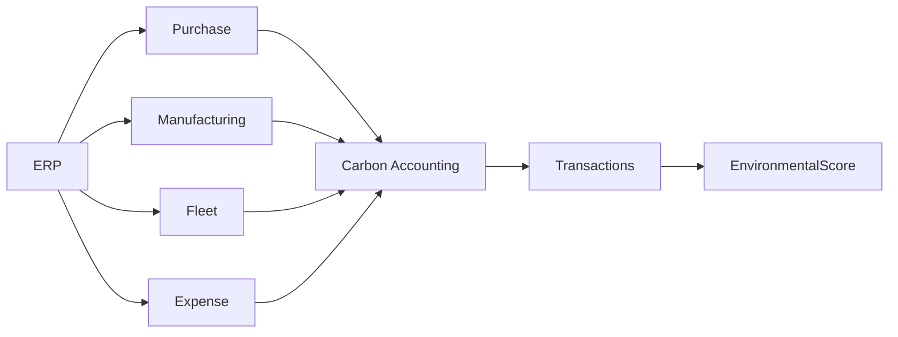

### Explanation

ERP operational data is converted into carbon emissions.

The calculated emissions are stored and contribute to the Environmental ESG Score.

---

# 6. CSR & Gamification Flow

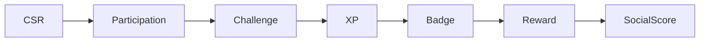

Employees participate in CSR programs, earn XP and badges, redeem rewards and improve the Social Score.

---

# 7. Governance Flow

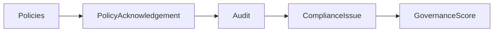

Governance ensures policy compliance through acknowledgements, audits and issue tracking.

---

# 8. ESG Score Engine

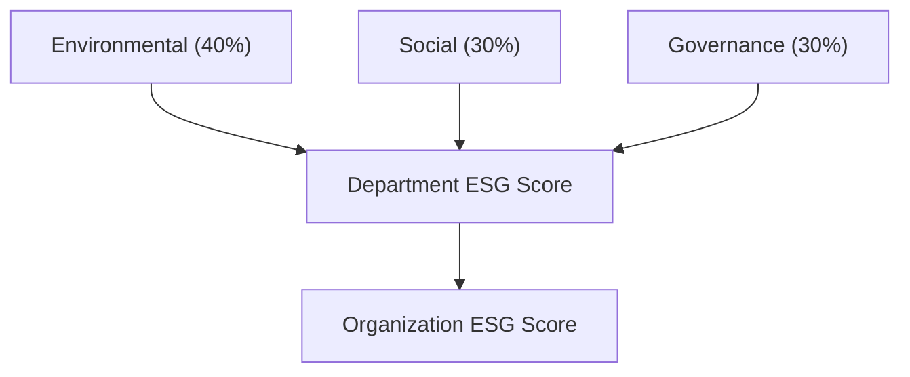

The ESG Score Engine combines Environmental, Social and Governance scores into department and organization-level ESG scores.

---

# 9. AI & Analytics Layer

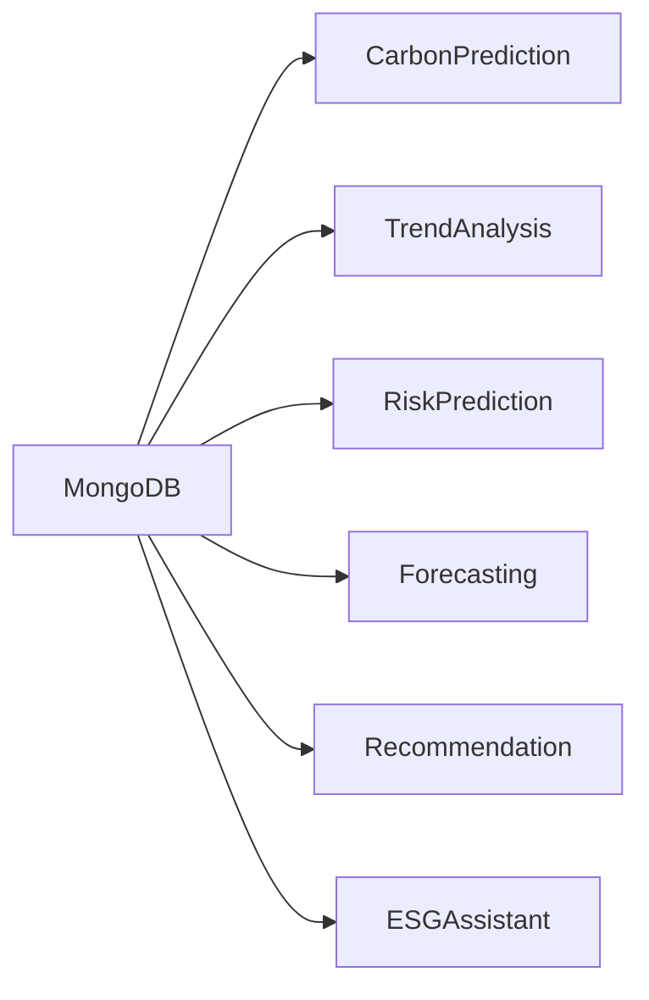

### AI Features

- Carbon Prediction
- ESG Trend Analysis
- KPI Forecasting
- Compliance Risk Prediction
- Sustainability Recommendation
- AI ESG Chat Assistant

---

# 10. MongoDB Database

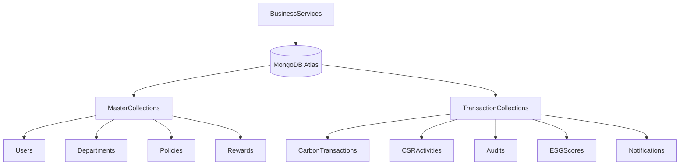

### Master Collections

- Users
- Departments
- Categories
- Emission Factors
- Goals
- Policies
- Rewards
- Badges

### Transaction Collections

- Carbon Transactions
- CSR Activities
- Employee Participation
- Challenges
- Audits
- ESG Scores
- Notifications

---

# 11. External Integrations

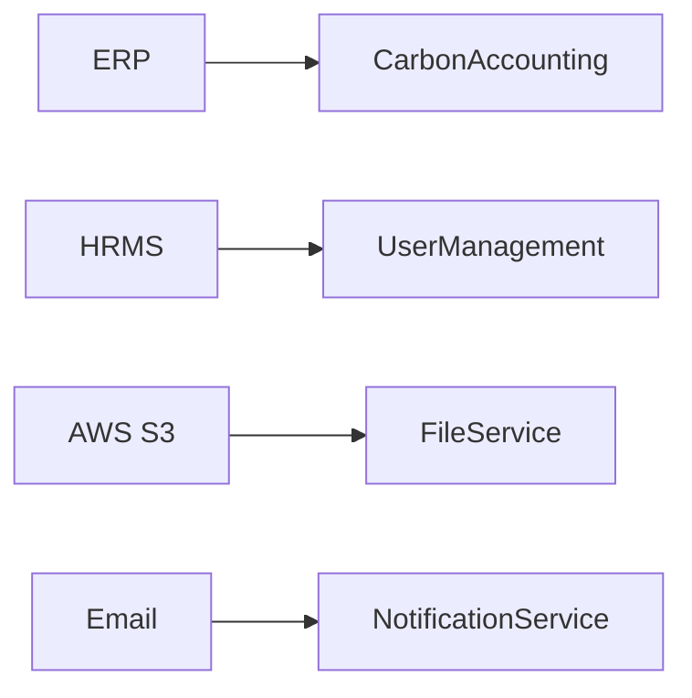

### Integrations

- ERP
- HRMS
- AWS S3
- SMTP Email

---

# 12. End-to-End Workflow

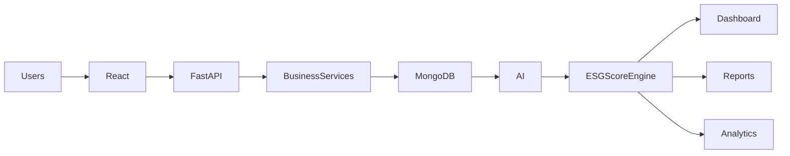

---

# Technology Stack

| Layer | Technology |
|------|------------|
| Frontend | React + TypeScript + Tailwind CSS |
| Backend | FastAPI |
| Authentication | JWT |
| Database | MongoDB Atlas |
| Cache | Redis |
| Storage | AWS S3 |
| Reports | Pandas + OpenPyXL + ReportLab |
| Notifications | Firebase + SMTP |
| Deployment | Docker + Nginx + AWS |

---

# Advantages

- Modular Microservice Architecture
- Scalable FastAPI Backend
- Flexible MongoDB Database
- AI-powered ESG Analytics
- Secure JWT Authentication
- Automatic ESG Score Calculation
- ERP & HRMS Integration
- Cloud-ready Deployment
- Real-time Dashboards
- Easy Future Expansion

---

# Conclusion

EcoSphere integrates operational systems, ESG workflows, AI analytics and MongoDB into a single platform that helps organizations measure, monitor and improve their Environmental, Social and Governance performance through automated data collection, intelligent scoring and real-time dashboards
